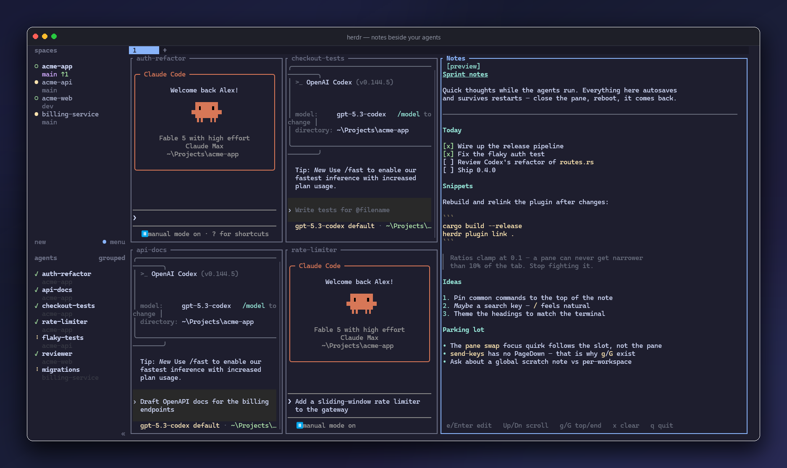
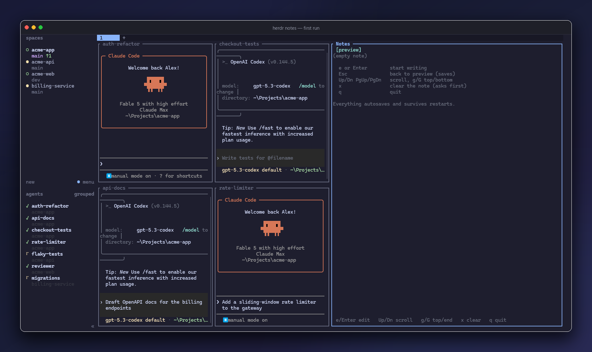
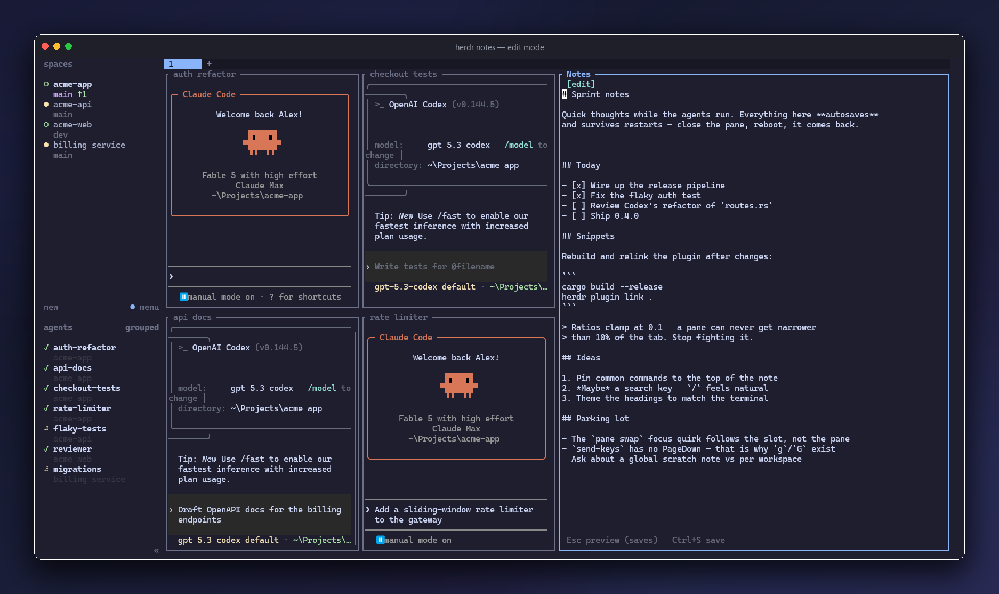

<div align="center">

# Herdr Notes

### The scratch note that lives beside your agents.

One markdown note per workspace in a dockable [herdr](https://github.com/ogulcancelik/herdr)
pane — rendered preview, plain-text editing, and it never forgets: everything
autosaves and survives computer restarts.


<br><br>



</div>

That's the note docked on the right, keeping its shape while the test suite runs
next door. Terminals are where the work happens, and the work generates thoughts —
half-finished todo lists, commands you keep retyping, things to ask about later.
This gives them a permanent home one keypress away: no editor window, no stray
`notes.txt`, no saving.

```
herdr plugin install alexarthurs/herdr-notes
```

---

## Why you'll keep it open

- **Rendered markdown** — headings, checkboxes, lists, quotes, code blocks
  and inline styles, drawn natively in the terminal with a scrollbar.
- **Zero-friction editing** — `e` to type, `Esc` to go back. That's it.
- **A note per workspace** — every herdr space keeps its own note, keyed to
  the workspace itself (renames don't lose it).
- **Actually persistent** — atomic autosaves to a per-workspace JSON file in
  herdr's config directory. Close the pane, kill the terminal, reboot: it
  comes back.
- **A polite pane** — one toggle action opens, focuses, or closes it; a
  heartbeat token means a dead pane — even one left behind by a herdr
  server restart — gets replaced on the next toggle, never duplicated.

## Install

From a checkout of this repo:

```
cargo build --release
herdr plugin link .
```

Or straight from GitHub with the command under the hero image.

## Open

One toggle action, scoped to the current tab — it opens the pane docked on
the right edge, focuses it if it's already open, and closes it if it's focused:

```
herdr plugin action invoke herdr-notes.open-notes-windows   # windows
herdr plugin action invoke herdr-notes.open-notes           # linux / macos
```

First run greets you with the keymap:

<div align="center">

</div>

## Keys

Preview (default):

| Key | Action |
| --- | --- |
| `e` / `Enter` | edit the note |
| `Up` `Down` `PgUp` `PgDn` | scroll |
| `g` / `G` | jump to top / bottom |
| `x` | clear the note (y/N confirm) |
| `q` | quit |

Edit:

| Key | Action |
| --- | --- |
| `Esc` | back to preview (saves) |
| `Ctrl+S` | save now (autosave runs anyway, ~2s after the last keystroke) |

`Esc` never exits the app.

<div align="center">

</div>

## Persistence

Each herdr workspace gets its own note, stored as
`<workspace-id>.json` in herdr's per-plugin state directory
(`HERDR_PLUGIN_STATE_DIR` — e.g. `%LOCALAPPDATA%\herdr\plugins\herdr-notes\`
on Windows), keyed by the stable `HERDR_WORKSPACE_ID` herdr injects into
every pane — ids survive workspace renames, so the note follows the
workspace, not its label. Closing a workspace just orphans its file; delete
`<workspace-id>.json` by hand if you want it gone. Run outside herdr, the
pane falls back to `herdr/notes/` under the platform config dir (single
shared `notes.json` when there's no workspace id), and any note found in
the fallback layout is moved into the state dir on first load — an
existing note is inherited, never lost.

The format is `{ "text": "...", "mode": "preview"|"edit" }`. Saves are
atomic (temp file + fsync + rename) and happen on leaving edit mode, clear,
quit, and debounced while typing. A missing or corrupt file falls back to
an empty note — it never wedges the pane.

## Hacking

`CLAUDE.md` has the build/dev workflow and the hard-won herdr/Windows
gotchas (pane spawning, heartbeats, PowerShell 5.1 quirks). The short
version: `cargo build --release`, `cargo test`,
`cargo clippy --all-targets -- -D warnings`, all green before shipping.
